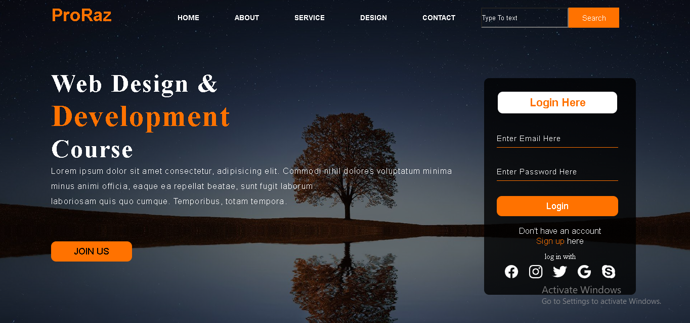

# Web Design Landing Page

A modern desktop-based landing page built using HTML5 and CSS3. This project includes a navigation bar, hero section, search box, login form, and call-to-action button with a clean user interface.

## Features

- Modern Landing Page Design
- Navigation Bar
- Hero Section
- Login Form UI
- Search Bar
- Call-To-Action Button
- Clean Layout Structure
- Desktop Optimized Design

## Technologies Used

- HTML5
- CSS3

## Project Structure

```text
Web-Design-Landing-Page/
│
├── media/
├── screenshots/
│   └── Web-page.png
│
├── index.html
├── style.css
└── README.md
```

## Screenshot



## Live Demo

🔗 https://saifpydev.github.io/full-stack-mini-projects/Frontend-Projects/Web-Design-Landing-Page/

## Source Code

🔗 https://github.com/Saifpydev/full-stack-mini-projects/tree/master/Frontend-Projects/Web-Design-Landing-Page

## Learning Outcomes

Through this project, I practiced:

- Building landing page layouts using HTML
- Styling web pages with CSS
- Working with Flexbox
- Creating forms and navigation menus
- Organizing project files professionally
- Managing projects using Git and GitHub

## Project Status

✅ Completed

## Note

This project is designed for desktop view and was created for learning and portfolio purposes.

## Author

**Saif Farid**

GitHub: https://github.com/Saifpydev